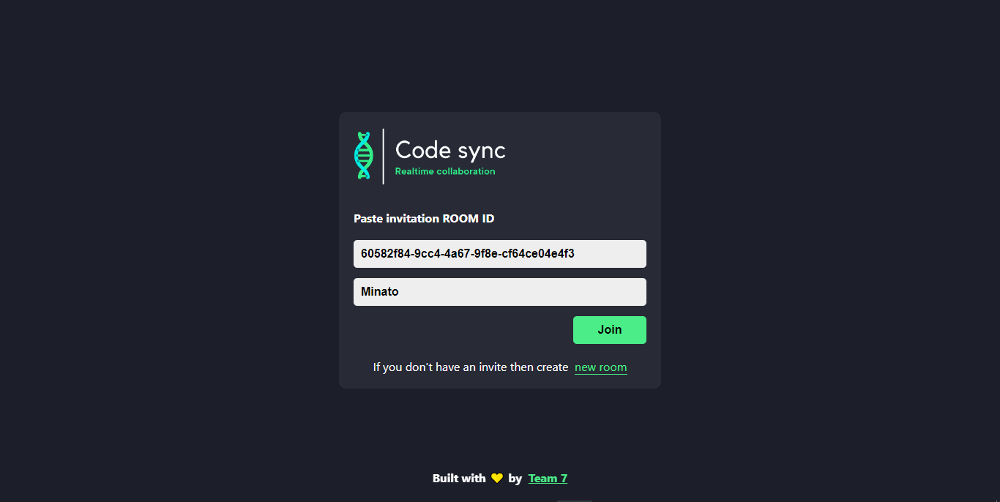
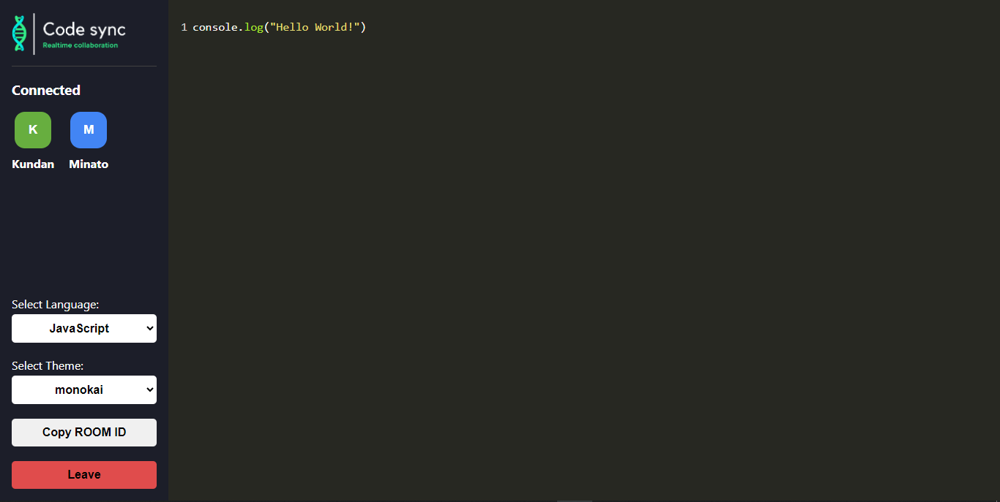

# Code Sync

Code Sync is a web application designed to provide a collaborative code editor where users can work together in real-time. The editor supports syntax highlighting for 21 programming languages and offers 63 design themes to customize the coding environment.

## Features

- **Responsive Design**: Optimized for various devices to ensure a seamless experience across desktops, tablets, and mobile devices.
- **Realtime Collaborative Code Editor**: Enables multiple users to edit the same code simultaneously with changes synced in real-time.
- **Language Support**: Supports syntax highlighting for 21 programming languages.
- **Theme Support**: Offers 63 design themes to personalize the coding environment.

## Tech Stack

### Frontend

- **React**: JavaScript library for building user interfaces.
- **Recoil**: State management library for React.
- **CodeMirror**: Versatile text editor implemented in JavaScript for the browser.
- **react-hot-toast**: Notifications for React applications.
- **axios**: Promise-based HTTP client for the browser and Node.js.
- **react-router**: Declarative routing for React.

### Backend

- **Node.js**: JavaScript runtime built on Chrome's V8 JavaScript engine.
- **Express.js**: Fast, unopinionated, minimalist web framework for Node.js.
- **Socket.io**: Enables real-time, bidirectional, and event-based communication.

## Installation

1. Clone the repository:
   ```sh
   git clone https://github.com/Kundan10424/code-sync.git
   cd code-sync
   ```

2. Install dependencies for both frontend and backend:
   ```sh
   npm install
   cd client
   npm install
   cd ..
   ```

3. Start the development server:
   ```sh
   npm run dev
   ```

## Usage

1. Open your browser and navigate to `http://localhost:3000`.
2. Create or join a session to start collaborating in real-time.

## Screenshots




##Live Demo
Check out the live dem of Code Sync: [here](https://github.com/Kundan10424/Realtime-Editor).
## Contributing

Contributions are welcome! Please fork the repository and submit a pull request.
